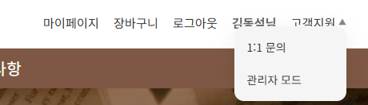
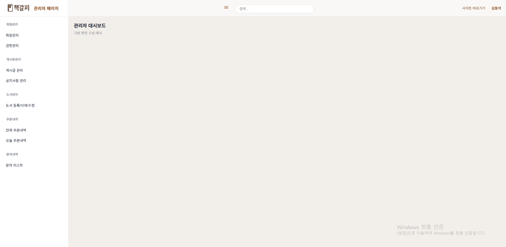
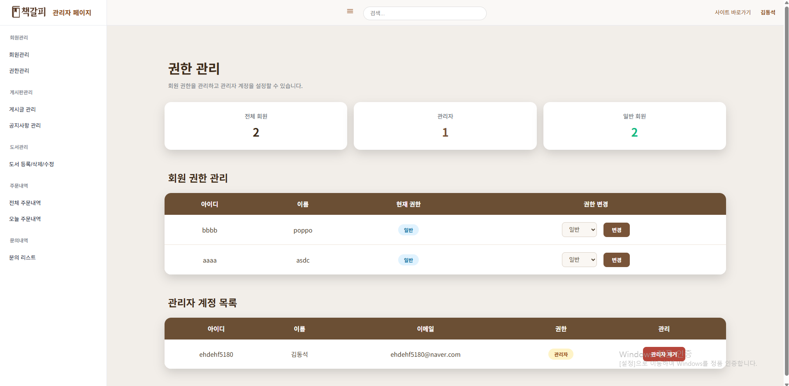
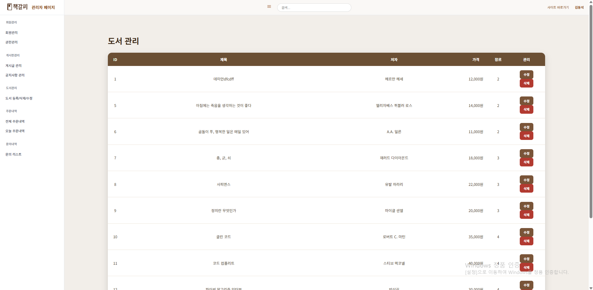
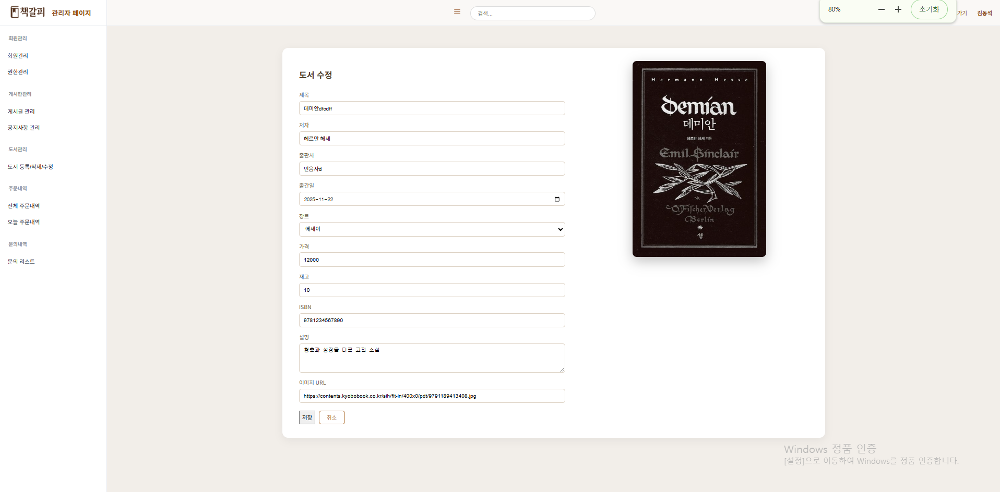
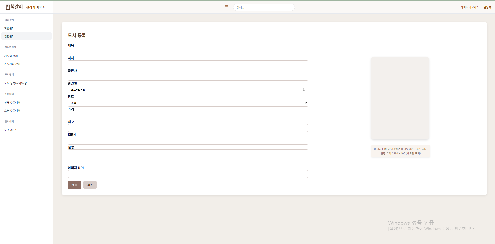

<div align="center">

# 📚 온라인 북스토어(책갈피)  
### Spring Boot · MyBatis · Oracle 기반 온라인 도서 판매 플랫폼

<br>


<br><br>
</div>

---

## 📖 프로젝트 개요

온라인 북스토어는 **도서 검색, 장바구니, 결제, 주문 관리** 기능을 제공하는  
웹 기반 쇼핑몰 프로젝트입니다.

- 개발 기간 : 1차: `2025.10.13 ~ 2025.10.19`, 2차: `2025.11.13 ~ 2025.11.20`
- 개발 인원 : `7명`  
### 👨‍💻 담당 역할

- 🧑‍🏫 **팀원** 

- 🗂 DB 설계 — 사용자·관리자 기능을 위한 테이블 구조 설계

- 🔐 관리자 인증/인가 — 관리자 로그인 및 관리자 홈 진입 로직 구현

- 👥 관리자 회원 관리 기능 — 회원 목록 조회, 상세 조회, 수정, 삭제 기능 전체 구현

- 🔧 권한 관리 기능 — 사용자 권한 부여 및 삭제 기능 개발

- 📚 도서 관리 기능 — 도서 등록 / 수정 / 삭제 기능 개발

- 🖥 관리자 프론트엔드 구축 — adminMain 기반 SPA 메뉴 로딩 시스템 구현

- 주요 특징

      🔐 관리자 로그인 로직 구현
        → 세션 기반 관리자 인증 및 접근 제어 처리
      
      👥 관리자 회원 관리 전체 구현
        → 회원 상세·수정·삭제 기능 구현 및 관리자 계정 제외 필터링 적용
      
      🔧 권한 관리 기능 구현
        → USER ↔ ADMIN 권한 변경 기능 개발
      
      📚 도서 관리 CRUD 구현
        → 도서 등록, 수정, 삭제 기능의 백엔드/프론트 로직 개발
      
      🖥 SPA 기반 관리자 페이지 구축
        → fetch 기반 화면 로딩, 페이지 이동 없는 동적 렌더링 구조 구현

---

## 🛠 기술 스택

| 분야 | 기술 |
|------|-------|
| **Frontend** |     |
| **Backend** |      |
| **Database** |  |
| **Infra / Server** |   |
| **API / External Services** |   |
| **Build Tool** |  |
| **Tools** |    |

---

## ✨ 주요 기능

### 🛍 사용자 기능
- 🔎 **도서 검색 / 카테고리별 조회**
- 📚 **도서 상세보기** (리뷰, 평점 포함)
- 🧡 **찜(좋아요) 목록 관리**
- 🛒 **장바구니** (추가, 수량 변경, 삭제)
- 💳 **도서 결제(Toss Payments API)**  
- 📦 **주문 생성 / 주문 내역 조회**

---

### 🔐 회원 기능
- 회원가입 / 로그인 / 로그아웃  
- 소셜 로그인(Naver / Google)  
- 아이디·비밀번호 찾기  
- 마이페이지(조회, 수정, 삭제)  
- 탈퇴 회원 관리  
- 찜한 도서 목록 확인

---

### 💬 커뮤니티 기능
- 사용자 게시판(글 작성, 수정, 조회, 삭제)
- 사용자 공지사항(공지 조회)
- 1대1 문의

---

### 🤖 AI 기능
- **Gemini API 기반 챗봇**  
  - 사용자 질문 자동 응답  

---

### 🛠 관리자 기능
- **회원 관리** (상태 변경, 탈퇴 회원 관리)
- **도서 관리** (등록 / 수정 / 삭제)
- **게시판 관리** (사용자 게시판·공지사항)
- **주문 관리** (주문 리스트, 주문 상세)
- **문의 리스트 관리**

---

### 🚀 기타 기능
- **페이징, 검색**
- **세션 기반 로그인 인증 처리**

---

## 🧭 메뉴 구조도 (PDF)

📄 메뉴 구조도 다운로드  
👉 [menu_structure_online_bookstore.pdf](https://github.com/user-attachments/files/24016562/menu_structure_online_bookstore.pdf)

---

## 🖥 화면 설계서 (PDF)

📄 화면 기획서 보기  
👉 [online-bookstore-ui-design.pdf](https://github.com/user-attachments/files/24016616/online-bookstore-ui-design.pdf)

---

## 🗂 ERD 및 테이블 명세서

📄 ERD  
<details> <summary><strong>ERD 다이어그램</strong></summary>


</details>

📄 테이블 명세서  
👉 [database-table-definition.xlsx](https://github.com/user-attachments/files/24016641/database-table-definition.xlsx)

---

🔍 핵심 구현 내용 (내가 담당한 기능)

🛠 관리자 기능

🔐 관리자 로그인 / 관리자 홈 진입 로직 구현
<details> <summary><strong>관리자 로그인 / 관리자 홈 진입 로직 구현</strong></summary> <div align="center">  <br> <sub>▲ 관리자 전용 로그인 화면</sub> </div>

📌 설명

일반 사용자와 분리된 관리자 인증/인가 로직을 직접 구현했습니다.

로그인 시 user_role 검사
→ ADMIN이면 관리자 메인(adminMain.jsp)으로 이동
→ 일반 회원이면 사용자 메인으로 이동

로그인 실패 5회 제한 + 30초 잠금 기능 구현

세션 기반 관리자 인증 구조(loginId, userRole) 설계

관리자 전용 메뉴 접근 시 세션 체크로 보안 강화

화면 이동은 전체 새로고침이 아닌 fetch 기반 비동기 페이지 로드 방식 적용

</details>
🧱 관리자 페이지 프론트엔드 전체 구조 개발
<details> <summary><strong>관리자 페이지 프론트엔드 전체 구조 개발</strong></summary> <div align="center">  <br> <sub>▲ 관리자 대시보드 전체 레이아웃 구조</sub> </div>

📌 설명

관리자 대시보드 전체 UI를 직접 설계 및 구현했습니다.

사이드바(회원관리 / 게시판관리 / 도서관리 / 주문관리 등) + 상단바 구성

모든 화면 전환을 새 페이지가 아닌
→ adminMain.jsp 내부 content-area로 동적 로딩하는 SPA-like 구조로 제작

fetch() 기반 페이지 로더(loadPage) 직접 구현

각 관리 페이지가 관리자 메인 레이아웃 안에서 자연스럽게 전환되도록 설계

팀원 프론트 코드와 충돌 없이 연동 가능하도록 구조 최적화

</details>
👥 관리자 회원 관리 기능 전체 구현
<details> <summary><strong>관리자 회원 관리 기능 전체 구현</strong></summary> <div align="center">  <br> <sub>▲ 관리자 회원 목록 및 상세 관리 화면</sub> </div>

📌 설명

회원 관리 전반의 흐름을 모두 구현했습니다.

회원 목록 조회(ADMIN 제외), 상세 조회, 수정, 삭제 기능 구현

상세 페이지는 JSP 로드 후 AJAX로 데이터 재조회하는 하이브리드 구조

수정은 JSON 기반 비동기 처리 → 성공 시 리스트 자동 갱신

삭제 후에도 목록이 즉시 새로고침되도록 처리

화면 이동 없이 adminMain 내부에서 모든 관리 기능 수행

MyBatis 기반 mapper → service → controller 전체 흐름 직접 작성

</details>
🛡 관리자 권한 관리 (권한 부여 / 삭제)
<details> <summary><strong>관리자 권한 관리(권한 부여 / 삭제)</strong></summary> <div align="center">  <br> <sub>▲ 관리자 권한 부여 및 해제 관리 화면</sub> </div>

📌 설명

관리자 권한을 안전하게 제어할 수 있도록 구현했습니다.

user_role 변경을 통한 관리자 권한 추가 / 해제 기능

잘못된 권한 변경을 방지하기 위해 단일 API로만 처리

권한 변경 시 프론트 UI 자동 반영

추후 관리자 세부 권한 확장(메뉴별 접근 제한 등)을 고려한 구조 설계

</details>
📚 도서 등록 / 수정 / 삭제 (CRUD) 기능 개발
<details> <summary><strong>도서 등록 / 수정 / 삭제 (CRUD) 기능 개발</strong></summary> <div align="center">    <br> <sub>▲ 도서 등록 · 수정 · 목록 관리 화면</sub> </div>

📌 설명

도서 관리 기능을 관리자 화면 내부에서 모두 처리할 수 있도록 구현했습니다.

도서 등록 / 수정 / 삭제 기능 전체 구현

도서 상세 페이지에서 바로 수정 가능하도록 설계

JSON 기반 비동기 요청으로 adminMain 내부에서 처리

처리 후 도서 목록 자동 갱신

이미지 업로드, 재고 관리 기능 확장이 가능하도록 구조 설계

</details>

---

## 📬 프로젝트 구조

```plaintext
📦 boot_bookstore
├─ src/main/java/com.bookstore
│  ├─ controller
│  ├─ service
│  ├─ dao
│  ├─ dto
│  └─ config
├─ src/main/resources
│  ├─ mapper
│  ├─ static
│  └─ templates(JSP)
└─ docs
   ├─ menu-structure.pdf
   ├─ ui-design.pdf
   ├─ erd.pdf
   └─ table-definition.pdf
```

## 🚀 시연 영상 & 데모

아래 영상은 온라인 북스토어(책갈피)의 주요 기능을 실제 화면과 함께 보여줍니다.  
각 기능별 동작 방식과 흐름을 직관적으로 확인할 수 있습니다.

### 📌 전체 시연 영상
🔗 YouTube 링크: https://youtu.be/3Dzys_04iNE (사용자)<br>
🔗 YouTube 링크: https://youtu.be/qynV_2sgY8g (관리자)

---
<!--
## ✨ 기능별 시연

### 🛒 1. 장바구니 기능
- 비로그인 장바구니 유지  
- 로그인 시 DB 장바구니와 병합  
- 수량 변경 / 삭제  


---

### 💳 2. Toss 결제 프로세스
- 결제 준비 → 승인 API 처리  
- 결제 성공 시 주문 자동 생성  


---

### 📦 3. 주문 생성 및 주문 내역 조회
- 주문 상세 페이지  
- 구매 이력 확인  


---

### 🛍️ 4. 도서 검색 / 카테고리 조회
- 키워드 기반 검색  
- 카테고리 필터  


---

### 🔐 5. 회원가입 / 로그인 / 로그아웃
- 아이디 중복 체크  
- 세션 기반 로그인 처리  


---

### 🛠 6. 관리자 페이지
- 도서 등록 / 수정 / 삭제  
- 이미지 업로드  
- 재고 관리  

-->


